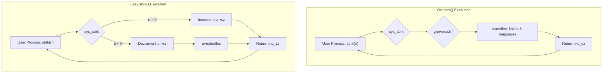
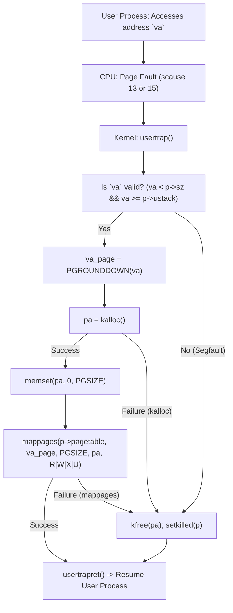
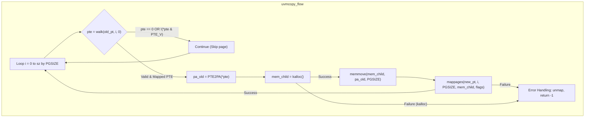
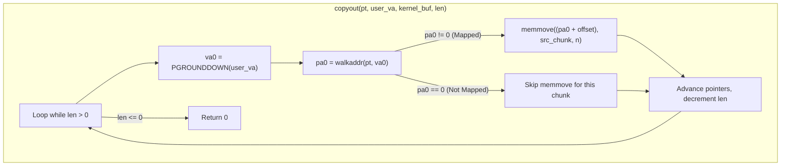

# Lazy Memory Allocation in xv6

This document details the implementation of lazy memory allocation in the xv6 operating system, a feature that defers the allocation of physical memory until the moment a user process actually attempts to access it. This approach can optimize performance and memory usage, especially for programs that request large amounts of memory but only use a fraction of it.

The implementation follows the main tasks outlined in the [Lazy Lab Guide](https://xiayingp.gitbook.io/build_a_os/labs/lab-4-lazy).

## Core Changes

### 1. Eliminating Allocation from `sbrk()`

The `sbrk()` system call is modified to no longer eagerly allocate physical memory. Instead, it only adjusts the process's declared memory size (`p->sz`).

**File:** `kernel/sysproc.c`

**Logic:**
- If `n` (argument to `sbrk`) is positive, `p->sz` is incremented by `n`.
- If `n` is negative, `p->sz` is decremented by `n`, and `uvmdealloc` is called to potentially free pages that were previously allocated and are now outside the new, smaller size.
- Physical memory allocation is deferred until a page fault occurs.

**Execution Flow Comparison:**

### 2. Handling Page Faults for Lazy Allocation

When a user process attempts to access a virtual address that is within its declared size (`p->sz`) but has not yet been backed by physical memory, a page fault occurs. The `usertrap` function is modified to handle these faults.

**File:** `kernel/trap.c` (within `usertrap()`)

**Logic:**
1.  The trap handler checks if the cause of the trap (`r_scause()`) is a page fault (13 for load, 15 for store).
2.  It retrieves the faulting virtual address (`va`) from `r_stval()`.
3.  **Validation Checks:**
    *   If `va >= p->sz` (address is beyond the process's allocated size), it's a segmentation fault; the process is marked as killed.
    *   If `va < p->ustack` (address is below the user stack guard page), it's also a segmentation fault; the process is marked killed. `p->ustack` is a new field in `struct proc` initialized in `exec.c` to mark the bottom of the valid stack region.
4.  **On-Demand Allocation:**
    *   If the address is valid for lazy allocation, `va` is rounded down to a page boundary (`PGROUNDDOWN(va)`).
    *   A new physical page is allocated using `kalloc()`.
    *   The page is zero-filled using `memset()`.
    *   The new physical page is mapped to the faulting virtual address in the process's page table using `mappages()` with `PTE_W|PTE_R|PTE_X|PTE_U` permissions.
    *   If `kalloc()` or `mappages()` fail, the process is killed.
5.  If allocation is successful, the trap handler returns, and the user process resumes execution from the faulting instruction.

**User Stack Guard (`p->ustack`):**
-   **File:** `kernel/proc.h` - Added `uint64 ustack;` to `struct proc`.
-   **File:** `kernel/exec.c` - Initialized `p->ustack = stackbase;` where `stackbase` is the lowest valid address of the initial user stack.

**Page Fault Handling Flow:**

### 3. Adjustments in `kernel/vm.c`

Several functions in `vm.c` are modified to work correctly with the possibility of unmapped (but valid) pages.

#### `uvmunmap`
When deallocating pages (e.g., during `sbrk(-n)` or `exit`), `uvmunmap` might encounter pages that were declared but never faulted in (and thus never mapped).
-   **Change:** If `walk()` returns a null PTE or if the `PTE_V` bit is not set, `uvmunmap` now `continue`s to the next page instead of panicking.

#### `uvmcopy`
During `fork()`, `uvmcopy` copies the parent's address space to the child. If the parent has lazily allocated regions, these should not be physically copied but rather set up to be lazily faulted in by the child.
-   **Change:** If `walk()` on the parent's page table returns a null PTE or if `PTE_V` is not set for a page, `uvmcopy` `continue`s, effectively not copying that page. The child will allocate it on-demand via a page fault if it accesses that address.

**`uvmcopy` with Lazy Pages Flow:**

#### `copyout`
This function copies data from the kernel to user space. If the destination user address range includes pages that haven't been faulted in yet, `copyout` should not fail.
-   **Change:** `copyout` now uses `walkaddr()` to get the physical address. If `walkaddr()` returns 0 (meaning the page is not mapped), the `memmove` for that chunk is skipped. `copyout` will return 0, indicating success from its perspective. The user process will trigger a page fault if it later tries to *read* from the parts of the buffer that weren't written to because the corresponding pages were not yet mapped.
-   **Note:** This behavior differs from the original xv6, where an unmapped page in the destination range during `copyout` would typically cause an error. The permissions (like `PTE_W`) are also not explicitly checked here, relying on the page fault handler to map with correct permissions.

**`copyout` with Lazy Pages Flow:**

#### `copyin` and `copyinstr`
These functions copy data from user space to the kernel. The guide suggested a modification similar to `copyout`. However, if `walkaddr()` returns 0 for a source user address, it means the user process is providing an invalid pointer (pointing to unmapped memory) as a source for data.
-   **Decision:** The original behavior of `copyin` and `copyinstr` is maintained. If `walkaddr()` returns 0, these functions will return -1, causing the system call to fail. This is because the kernel cannot safely read from an unmapped user address, and it's the user process's responsibility to provide valid, accessible source pointers. Lazy allocation will trigger if the user *itself* tries to read from its memory *before* passing it to a syscall.

### 4. `vmprint` Utility
For debugging and understanding memory layout, a `vmprint` function was added.

**Files:** `kernel/vm.c`, `kernel/defs.h`, `kernel/exec.c`
-   `vmprint_helper` and `vmprint` in `kernel/vm.c` recursively print valid PTEs and their corresponding physical addresses, indicating page table levels.
-   Declaration added to `kernel/defs.h`.
-   A call to `vmprint(p->pagetable)` is made in `kernel/exec.c` for the first user process (`init`) to display its initial page table structure.

## The `lazytest` User Program

The `lazytest` user program (not detailed in the guide but typically part of such labs) is designed to verify the correct functioning of the lazy allocation system. Its likely tests include:

1.  **Basic `sbrk()` and Access:**
    *   Call `sbrk()` to request a small amount of memory.
    *   Write to and read from this memory to trigger page faults and ensure on-demand allocation works.
2.  **Large Allocation, Sparse Access:**
    *   Call `sbrk()` to request a large chunk of memory.
    *   Access only a few, sparsely located pages within this large chunk.
    *   Verify that only the accessed pages are actually allocated (checked by observing kernel messages or `vmprint` output if instrumented, or by ensuring the system doesn't run out of memory prematurely).
3.  **`sbrk()` with Negative Argument:**
    *   Allocate memory, then call `sbrk()` with a negative argument to reduce the size.
    *   Attempt to access memory in the deallocated region; this should result in a segmentation fault.
    *   Access memory in the remaining allocated region; this should be fine.
4.  **Out-of-Bounds Access:**
    *   Attempt to access memory beyond the size set by `sbrk()`. This should result in a segmentation fault.
5.  **Guard Page Test:**
    *   Attempt to access memory just below the allocated user stack (the guard page area). This should result in a segmentation fault.
6.  **Fork Test (`uvmcopy` correctness):**
    *   Parent process allocates memory lazily (some accessed, some not).
    *   Parent forks.
    *   Child process attempts to access pages that were accessed by the parent (should be fine, copied or COW).
    *   Child process attempts to access pages that were *not* accessed by the parent (should trigger a new page fault in the child, allocating memory for the child).
7.  **`read`/`write` System Call Test (`copyin`/`copyout` correctness):**
    *   Allocate a buffer using `sbrk()`, but don't touch all of it.
    *   Use this buffer in a `read()` or `write()` system call (e.g., `write` to a file, `read` from a file).
    *   Verify that `copyout` correctly skips unmapped parts if writing, and that reading into an un-faulted buffer works by triggering faults.

The `lazytest` program helps confirm that memory is allocated only when needed, that protections are in place (guard pages, out-of-bounds access), and that memory management functions like `fork` correctly handle lazily allocated regions.

## Conclusion

Implementing lazy allocation in xv6 demonstrates a powerful OS optimization technique. By deferring physical memory allocation until the point of actual use, the system can handle programs with large, sparse memory requirements more efficiently, saving memory and potentially improving startup times. The core of this change involves modifying `sbrk` and implementing a page fault handler that allocates pages on demand. 